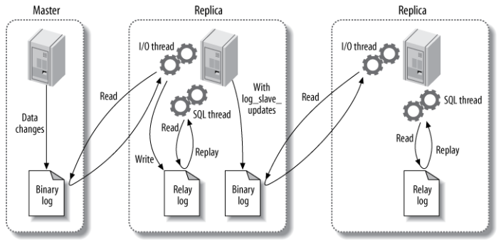

# 一、索引

## B+ Tree 原理

### 1. 数据结构

B Tree 指的是 Balance Tree，也就是平衡树。平衡树是一颗查找树，并且所有叶子节点位于同一层。

B+ Tree 是基于 B Tree 和叶子节点顺序访问指针进行实现，它具有 B Tree 的平衡性，并且通过顺序访问指针来提高区间查询的性能。

在 B+ Tree 中，一个节点中的 key 从左到右非递减排列，如果某个指针的左右相邻 key 分别是 key<sub>i</sub> 和 key<sub>i+1</sub>，且不为 null，则该指针指向节点的所有 key 大于等于 key<sub>i</sub> 且小于等于 key<sub>i+1</sub>。

<div align="center">  </div><br>

### 2. 操作

进行查找操作时，首先在根节点进行**二分查找**，找到一个 key 所在的指针，然后递归地在指针所指向的节点进行查找。直到查找到叶子节点，然后在叶子节点上进行二分查找，找出 key 所对应的 data。

插入删除操作会破坏平衡树的平衡性，因此在插入删除操作之后，需要对树进行一个分裂、合并、旋转等操作来维护平衡性。

### 3. 与红黑树的比较

红黑树等平衡树也可以用来实现索引，但是文件系统及数据库系统普遍采用 B+ Tree 作为索引结构，主要有以下两个原因：

（一）更少的查找次数

平衡树查找操作的时间复杂度和树高 h 相关，O(h)=O(log<sub>d</sub>N)，其中 d 为每个节点的出度。

红黑树的出度为 2，而 B+ Tree 的出度一般都非常大，所以红黑树的树高 h 很明显比 B+ Tree 大非常多，查找的次数也就更多。

（二）利用磁盘预读特性

为了减少磁盘 I/O 操作，磁盘往往不是严格按需读取，而是每次都会预读。预读过程中，磁盘进行顺序读取，顺序读取不需要进行磁盘寻道，并且只需要很短的旋转时间，速度会非常快。

操作系统一般将内存和磁盘分割成固定大小的块，每一块称为一页，内存与磁盘以页为单位交换数据。数据库系统将索引的一个节点的大小设置为页的大小，使得一次 I/O 就能完全载入一个节点。并且可以利用预读特性，相邻的节点也能够被预先载入。

## MySQL 索引

索引是在存储引擎层实现的，而不是在服务器层实现的，所以不同存储引擎具有不同的索引类型和实现。

### 1. B+Tree 索引

是大多数 MySQL 存储引擎的默认索引类型。

因为不再需要进行全表扫描，只需要对树进行搜索即可，所以查找速度快很多。

除了用于查找，还可以用于排序和分组。

可以指定多个列作为索引列，多个索引列共同组成键。

适用于全键值、键值范围和键前缀查找，其中键前缀查找只适用于最左前缀查找。如果不是按照索引列的顺序进行查找，则无法使用索引。

InnoDB 的 B+Tree 索引分为主索引和辅助索引。主索引的叶子节点 data 域记录着完整的数据记录，这种索引方式被称为聚簇索引。因为无法把数据行存放在两个不同的地方，所以一个表只能有一个聚簇索引。

<div align="center">  </div><br>

辅助索引的叶子节点的 data 域记录着主键的值，因此在使用辅助索引进行查找时，需要先查找到主键值，然后再到主索引中进行查找。

<div align="center">  </div><br>

### 2. 哈希索引

哈希索引能以 O(1) 时间进行查找，但是失去了有序性：

- 无法用于排序与分组；
- 只支持精确查找，无法用于部分查找和范围查找。

InnoDB 存储引擎有一个特殊的功能叫“自适应哈希索引”，当某个索引值被使用的非常频繁时，会在 B+Tree 索引之上再创建一个哈希索引，这样就让 B+Tree 索引具有哈希索引的一些优点，比如快速的哈希查找。

### 3. 全文索引

MyISAM 存储引擎支持全文索引，用于查找文本中的关键词，而不是直接比较是否相等。

查找条件使用 MATCH AGAINST，而不是普通的 WHERE。

全文索引使用倒排索引实现，它记录着关键词到其所在文档的映射。

InnoDB 存储引擎在 MySQL 5.6.4 版本中也开始支持全文索引。

### 4. 空间数据索引

MyISAM 存储引擎支持空间数据索引（R-Tree），可以用于地理数据存储。空间数据索引会从所有维度来索引数据，可以有效地使用任意维度来进行组合查询。

必须使用 GIS 相关的函数来维护数据。


## 索引优化

### 1. 独立的列

在进行查询时，索引列不能是表达式的一部分，也不能是函数的参数，否则无法使用索引。

例如下面的查询不能使用 actor_id 列的索引：

```sql
SELECT actor_id FROM sakila.actor WHERE actor_id + 1 = 5;
```

### 2. 多列索引

在需要使用多个列作为条件进行查询时，使用多列索引比使用多个单列索引性能更好。例如下面的语句中，最好把 actor_id 和 film_id 设置为多列索引。

```sql
SELECT film_id, actor_ id FROM sakila.film_actor
WHERE actor_id = 1 AND film_id = 1;
```

### 3. 索引列的顺序

让选择性最强的索引列放在前面。

索引的选择性是指：不重复的索引值和记录总数的比值。最大值为 1，此时每个记录都有唯一的索引与其对应。选择性越高，查询效率也越高。

例如下面显示的结果中 customer_id 的选择性比 staff_id 更高，因此最好把 customer_id 列放在多列索引的前面。

```sql
SELECT COUNT(DISTINCT staff_id)/COUNT(*) AS staff_id_selectivity,
COUNT(DISTINCT customer_id)/COUNT(*) AS customer_id_selectivity,
COUNT(*)
FROM payment;
```

```html
   staff_id_selectivity: 0.0001
customer_id_selectivity: 0.0373
               COUNT(*): 16049
```

### 4. 前缀索引

对于 BLOB、TEXT 和 VARCHAR 类型的列，必须使用前缀索引，只索引开始的部分字符。

对于前缀长度的选取需要根据索引选择性来确定。

### 5. 覆盖索引

索引包含所有需要查询的字段的值。

具有以下优点：

- 索引通常远小于数据行的大小，只读取索引能大大减少数据访问量。
- 一些存储引擎（例如 MyISAM）在内存中只缓存索引，而数据依赖于操作系统来缓存。因此，只访问索引可以不使用系统调用（通常比较费时）。
- 对于 InnoDB 引擎，若辅助索引能够覆盖查询，则无需访问主索引。

## 索引的优点

- 大大减少了服务器需要扫描的数据行数。

- 帮助服务器避免进行排序和分组，以及避免创建临时表（B+Tree 索引是有序的，可以用于 ORDER BY 和 GROUP BY 操作。临时表主要是在排序和分组过程中创建，因为不需要排序和分组，也就不需要创建临时表）。

- 将随机 I/O 变为顺序 I/O（B+Tree 索引是有序的，会将相邻的数据都存储在一起）。

## 索引的使用条件

- 对于非常小的表、大部分情况下简单的全表扫描比建立索引更高效；
- 对于中到大型的表，索引就非常有效；
- 但是对于特大型的表，建立和维护索引的代价将会随之增长。这种情况下，需要用到一种技术可以直接区分出需要查询的一组数据，而不是一条记录一条记录地匹配，例如可以使用分区技术。


# 二、查询性能优化

## 使用 Explain 进行分析

Explain 用来分析 SELECT 查询语句，开发人员可以通过分析 Explain 结果来优化查询语句。

比较重要的字段有：

- select_type : 查询类型，有简单查询、联合查询、子查询等
- key : 使用的索引
- rows : 扫描的行数

## 优化数据访问

### 1. 减少请求的数据量

- 只返回必要的列：最好不要使用 SELECT * 语句。
- 只返回必要的行：使用 LIMIT 语句来限制返回的数据。
- 缓存重复查询的数据：使用缓存可以避免在数据库中进行查询，特别在要查询的数据经常被重复查询时，缓存带来的查询性能提升将会是非常明显的。

### 2. 减少服务器端扫描的行数

最有效的方式是使用索引来覆盖查询。

## 重构查询方式

### 1. 切分大查询

一个大查询如果一次性执行的话，可能一次锁住很多数据、占满整个事务日志、耗尽系统资源、阻塞很多小的但重要的查询。

```sql
DELETE FROM messages WHERE create < DATE_SUB(NOW(), INTERVAL 3 MONTH);
```

```sql
rows_affected = 0
do {
    rows_affected = do_query(
    "DELETE FROM messages WHERE create  < DATE_SUB(NOW(), INTERVAL 3 MONTH) LIMIT 10000")
} while rows_affected > 0
```

### 2. 分解大连接查询

将一个大连接查询分解成对每一个表进行一次单表查询，然后在应用程序中进行关联，这样做的好处有：

- 让缓存更高效。对于连接查询，如果其中一个表发生变化，那么整个查询缓存就无法使用。而分解后的多个查询，即使其中一个表发生变化，对其它表的查询缓存依然可以使用。
- 分解成多个单表查询，这些单表查询的缓存结果更可能被其它查询使用到，从而减少冗余记录的查询。
- 减少锁竞争；
- 在应用层进行连接，可以更容易对数据库进行拆分，从而更容易做到高性能和可伸缩。
- 查询本身效率也可能会有所提升。例如下面的例子中，使用 IN() 代替连接查询，可以让 MySQL 按照 ID 顺序进行查询，这可能比随机的连接要更高效。

```sql
SELECT * FROM tab
JOIN tag_post ON tag_post.tag_id=tag.id
JOIN post ON tag_post.post_id=post.id
WHERE tag.tag='mysql';
```

```sql
SELECT * FROM tag WHERE tag='mysql';
SELECT * FROM tag_post WHERE tag_id=1234;
SELECT * FROM post WHERE post.id IN (123,456,567,9098,8904);
```

# 三、存储引擎

本人 8.0.12 MySQL版本，查看其支持的存储引擎的语句以及显示如下：

```sql
mysql> show engines \G;
*************************** 1. row ***************************
      Engine: ARCHIVE
     Support: YES
     Comment: Archive storage engine
Transactions: NO
          XA: NO
  Savepoints: NO
*************************** 2. row ***************************
      Engine: BLACKHOLE
     Support: YES
     Comment: /dev/null storage engine (anything you write to it disappears)
Transactions: NO
          XA: NO
  Savepoints: NO
*************************** 3. row ***************************
      Engine: MRG_MYISAM
     Support: YES
     Comment: Collection of identical MyISAM tables
Transactions: NO
          XA: NO
  Savepoints: NO
*************************** 4. row ***************************
      Engine: FEDERATED
     Support: NO
     Comment: Federated MySQL storage engine
Transactions: NULL
          XA: NULL
  Savepoints: NULL
*************************** 5. row ***************************
      Engine: MyISAM
     Support: YES
     Comment: MyISAM storage engine
Transactions: NO
          XA: NO
  Savepoints: NO
*************************** 6. row ***************************
      Engine: PERFORMANCE_SCHEMA
     Support: YES
     Comment: Performance Schema
Transactions: NO
          XA: NO
  Savepoints: NO
*************************** 7. row ***************************
      Engine: InnoDB
     Support: DEFAULT
     Comment: Supports transactions, row-level locking, and foreign keys
Transactions: YES
          XA: YES
  Savepoints: YES
*************************** 8. row ***************************
      Engine: MEMORY
     Support: YES
     Comment: Hash based, stored in memory, useful for temporary tables
Transactions: NO
          XA: NO
  Savepoints: NO
*************************** 9. row ***************************
      Engine: CSV
     Support: YES
     Comment: CSV storage engine
Transactions: NO
          XA: NO
  Savepoints: NO
9 rows in set (0.01 sec)
```

默认的存储引擎是innodb

在建表时可以指定存储引擎

```sql
mysql> create table ai(i bigint(20) not null auto_increment,primary key(i)) engine=myisam default charset=gbk;
Query OK, 0 rows affected (0.06 sec)
```

修改存储引擎

```
alter table ai engine = innodb;
```

常用的有四个存储引擎：myisam，innodb，memory，merge


## InnoDB

是 MySQL 默认的事务型存储引擎，只有在需要它不支持的特性时，才考虑使用其它存储引擎。

InnoDB提供了具有提交，回滚和崩溃恢复能力的事务安全。但是对比myisam，其写的处理效率差一些，并且会占有更多的磁盘空间来保留数据和索引。

实现了四个标准的隔离级别，默认级别是可重复读（REPEATABLE READ）。在可重复读隔离级别下，通过多版本并发控制（MVCC）+ 间隙锁（Next-Key Locking）防止幻影读。

主索引是聚簇索引，在索引中保存了数据，从而避免直接读取磁盘，因此对查询性能有很大的提升。

内部做了很多优化，包括从磁盘读取数据时采用的可预测性读、能够加快读操作并且自动创建的自适应哈希索引、能够加速插入操作的插入缓冲区等。

支持真正的在线热备份。其它存储引擎不支持在线热备份，要获取一致性视图需要停止对所有表的写入，而在读写混合场景中，停止写入可能也意味着停止读取。

## MyISAM

设计简单，数据以紧密格式存储。对于事务完整性没有要求或者以select，insert为主的应用，或者表比较小、可以容忍修复操作，则依然可以使用它，其优势是访问速度快。

提供了大量的特性，包括压缩表、空间数据索引等。

myisam支持三种不同的存储格式1，静态表（默认的存储格式，字段非变长，存储速度快，容易缓存，出现故障容易恢复，但是占用空间多）。2，动态表（包含变长字段，占用空间较少，但是容易产生内存碎片）。3，压缩表（占据很小的磁盘空间，每个记录单独压缩，所以非常小的访问开支）

不支持事务。

不支持行级锁，只能对整张表加锁，读取时会对需要读到的所有表加共享锁，写入时则对表加排它锁。但在表有读取操作的同时，也可以往表中插入新的记录，这被称为并发插入（CONCURRENT INSERT）。

可以手工或者自动执行检查和修复操作，但是和事务恢复以及崩溃恢复不同，可能导致一些数据丢失，而且修复操作是非常慢的。

如果指定了 DELAY_KEY_WRITE 选项，在每次修改执行完成时，不会立即将修改的索引数据写入磁盘，而是会写到内存中的键缓冲区，只有在清理键缓冲区或者关闭表的时候才会将对应的索引块写入磁盘。这种方式可以极大的提升写入性能，但是在数据库或者主机崩溃时会造成索引损坏，需要执行修复操作。

## 比较

- 事务：InnoDB 是事务型的，可以使用 Commit 和 Rollback 语句。

- 并发：MyISAM 只支持表级锁，而 InnoDB 还支持行级锁。

- 外键：InnoDB 支持外键。

- 备份：InnoDB 支持在线热备份。

- 崩溃恢复：MyISAM 崩溃后发生损坏的概率比 InnoDB 高很多，而且恢复的速度也更慢。

- 其它特性：MyISAM 支持压缩表和空间数据索引。

# 四、数据类型

## 整型

TINYINT, SMALLINT, MEDIUMINT, INT, BIGINT 分别使用 8, 16, 24, 32, 64 位存储空间，一般情况下越小的列越好。

INT(11) 中的数字只是规定了交互工具显示字符的个数，对于存储和计算来说是没有意义的。

## 浮点数

FLOAT 和 DOUBLE 为浮点类型，DECIMAL 为高精度小数类型。CPU 原生支持浮点运算，但是不支持 DECIMAl 类型的计算，因此 DECIMAL 的计算比浮点类型需要更高的代价。

FLOAT、DOUBLE 和 DECIMAL 都可以指定列宽，例如 DECIMAL(18, 9) 表示总共 18 位，取 9 位存储小数部分，剩下 9 位存储整数部分。

## 字符串

主要有 CHAR 和 VARCHAR 两种类型，一种是定长的，一种是变长的。

VARCHAR 这种变长类型能够节省空间，因为只需要存储必要的内容。但是在执行 UPDATE 时可能会使行变得比原来长，当超出一个页所能容纳的大小时，就要执行额外的操作。MyISAM 会将行拆成不同的片段存储，而 InnoDB 则需要分裂页来使行放进页内。

在进行存储和检索时，会保留 VARCHAR 末尾的空格，而会删除 CHAR 末尾的空格。

## 时间和日期

MySQL 提供了两种相似的日期时间类型：DATETIME 和 TIMESTAMP。

### 1. DATETIME

能够保存从 1001 年到 9999 年的日期和时间，精度为秒，使用 8 字节的存储空间。

它与时区无关。

默认情况下，MySQL 以一种可排序的、无歧义的格式显示 DATETIME 值，例如“2008-01-16 22:37:08”，这是 ANSI 标准定义的日期和时间表示方法。

### 2. TIMESTAMP

和 UNIX 时间戳相同，保存从 1970 年 1 月 1 日午夜（格林威治时间）以来的秒数，使用 4 个字节，只能表示从 1970 年到 2038 年。

它和时区有关，也就是说一个时间戳在不同的时区所代表的具体时间是不同的。

MySQL 提供了 FROM_UNIXTIME() 函数把 UNIX 时间戳转换为日期，并提供了 UNIX_TIMESTAMP() 函数把日期转换为 UNIX 时间戳。

默认情况下，如果插入时没有指定 TIMESTAMP 列的值，会将这个值设置为当前时间。

应该尽量使用 TIMESTAMP，因为它比 DATETIME 空间效率更高。

# 五、切分

## 水平切分

水平切分又称为 Sharding，它是将同一个表中的记录拆分到多个结构相同的表中。

当一个表的数据不断增多时，Sharding 是必然的选择，它可以将数据分布到集群的不同节点上，从而缓存单个数据库的压力。

<div align="center">  </div><br>

## 垂直切分

垂直切分是将一张表按列切分成多个表，通常是按照列的关系密集程度进行切分，也可以利用垂直切分将经常被使用的列和不经常被使用的列切分到不同的表中。

在数据库的层面使用垂直切分将按数据库中表的密集程度部署到不同的库中，例如将原来的电商数据库垂直切分成商品数据库、用户数据库等。

<div align="center">  </div><br>

## Sharding 策略

- 哈希取模：hash(key) % N；
- 范围：可以是 ID 范围也可以是时间范围；
- 映射表：使用单独的一个数据库来存储映射关系。

## Sharding 存在的问题

### 1. 事务问题

使用分布式事务来解决，比如 XA 接口。

### 2. 连接

可以将原来的连接分解成多个单表查询，然后在用户程序中进行连接。

### 3. ID 唯一性

- 使用全局唯一 ID（GUID）
- 为每个分片指定一个 ID 范围
- 分布式 ID 生成器 (如 Twitter 的 Snowflake 算法)

# 六、复制

## 主从复制

主要涉及三个线程：binlog 线程、I/O 线程和 SQL 线程。

-  **binlog 线程** ：负责将主服务器上的数据更改写入二进制日志（Binary log）中。
-  **I/O 线程** ：负责从主服务器上读取二进制日志，并写入从服务器的重放日志（Replay log）中。
-  **SQL 线程** ：负责读取重放日志并重放其中的 SQL 语句。

<div align="center">  </div><br>

## 读写分离

主服务器处理写操作以及实时性要求比较高的读操作，而从服务器处理读操作。

读写分离能提高性能的原因在于：

- 主从服务器负责各自的读和写，极大程度缓解了锁的争用；
- 从服务器可以使用 MyISAM，提升查询性能以及节约系统开销；
- 增加冗余，提高可用性。

读写分离常用代理方式来实现，代理服务器接收应用层传来的读写请求，然后决定转发到哪个服务器。

<div align="center">  </div><br>

# 参考资料

- BaronScbwartz, PeterZaitsev, VadimTkacbenko, 等. 高性能 MySQL[M]. 电子工业出版社, 2013.
- 姜承尧. MySQL 技术内幕: InnoDB 存储引擎 [M]. 机械工业出版社, 2011.
- [20+ 条 MySQL 性能优化的最佳经验](https://www.jfox.info/20-tiao-mysql-xing-nen-you-hua-de-zui-jia-jing-yan.html)
- [服务端指南 数据存储篇 | MySQL（09） 分库与分表带来的分布式困境与应对之策](http://blog.720ui.com/2017/mysql_core_09_multi_db_table2/ "服务端指南 数据存储篇 | MySQL（09） 分库与分表带来的分布式困境与应对之策")
- [How to create unique row ID in sharded databases?](https://stackoverflow.com/questions/788829/how-to-create-unique-row-id-in-sharded-databases)
- [SQL Azure Federation – Introduction](http://geekswithblogs.net/shaunxu/archive/2012/01/07/sql-azure-federation-ndash-introduction.aspx "Title of this entry.")
- [MySQL 索引背后的数据结构及算法原理](http://blog.codinglabs.org/articles/theory-of-mysql-index.html)
- [MySQL 性能优化神器 Explain 使用分析](https://segmentfault.com/a/1190000008131735)
- [How Sharding Works](https://medium.com/@jeeyoungk/how-sharding-works-b4dec46b3f6)
- [大众点评订单系统分库分表实践](https://tech.meituan.com/dianping_order_db_sharding.html)
- [B + 树](https://zh.wikipedia.org/wiki/B%2B%E6%A0%91)


# 数据库索引

MySQL官方对索引的定义为：索引（Index）是帮助MySQL高效获取数据的数据结构。提取句子主干，就可以得到索引的本质：索引是一种数据结构。

## 1 创建索引好处

1. 可以大大加快数据的检索速度，这也是创建索引的最主要的原因。
2. 将随机 I/O 变为顺序 I/O(B+Tree 索引是有序的，会将相邻的数据都存储在⼀一起)。
3. 可以加速表和表之间的连接，特别是在实现数据的参考完整性方面特别有意义。
4. 在使用分组和排序子句进行数据检索时，同样可以显著减少查询中分组和排序的时间。
5. 通过使用索引，可以在查询的过程中，使用优化隐藏器，提高系统的性能。

## 2 索引缺点

1. 创建索引和维护索引要耗费时间，这种时间随着数据量的增加而增加。
2. 索引需要占物理空间，增加了数据库的存储空间。
3. 当对表中的数据进行增加、删除和修改的时候，索引也要动态的维护，这样就降低了数据的维护速度。

## 3 索引失效

1. 如果MySQL估计使用全表扫秒比使用索引快，则不使用索引；
2. 如果条件中有or，即使其中有条件带索引也不会使用（要想使用or且让索引生效，将or条件中的每个列都加上索引）；
3. 复合索引，如果索引列不是复合索引的第一部分，则不使用索引（即不符合最左前缀）；
4. 如果like是以 % 开始的，则该列上的索引不会被使用；
5. 如果列为字符串，则where条件中必须将字符常量值加引号，否则即使该列上存在索引，也不会被使用；

## 4 在什么情况下适合建立索引

1. 为经常出现在关键字order by、group by、distinct后面的字段，建立索引；
2. 在union等集合操作的结果集字段上，建立索引
3. 为经常用作查询选择 where 后的字段，建立索引；
4. 在经常用作表连接 join 的属性上，建立索引；
5. 在经常用在连接的列上，这些列主要是一些外键，可以加快连接的速度
6. 考虑使用索引覆盖。
7. 对数据很少被更新的表，在经常需要搜索的列上建立索引，从而将表的扫描改变为索引的扫描。

## 5 为何采用B+树作为索引

1. 更少的查找次数 

平衡树查找操作的时间复杂度和树高 h 相关，O(h)=O(logdN)，其中 d 为每个节点的出度。 

红⿊树的出度为 2，⽽而 B+ Tree 的出度⼀一般都非常大，所以红⿊树的树高 h 很明显⽐ B+ Tree ⼤⾮常多，查找的次数也就更更多。 

2. 利用磁盘预读特性 

为了减少磁盘 I/O 操作，磁盘往往不是严格按需读取，⽽是每次都会预读。预读过程中，磁盘进行顺序读取，顺序读取不需要进行磁盘寻道，并且只需要很短的旋转时间，速度会⾮非常快。 

## 6 三种索引

1. 唯一索引: 唯一索引是不允许其中任何两行具有相同索引值的索引。数据库还可能防止添加将在表中创建重复键值的新数据.
2. 主键索引，在数据库关系图中为表定义主键将自动创建主键索引，主键索引是唯一索引的特定类型。该索引要求主键中的每个值都唯一。当在查询中使用主键索引时，它还允许对数据的快速访问。
3. 聚集索引，在聚集索引中，表中行的物理顺序与键值的逻辑（索引）顺序相同。一个表只能包含一个聚集索引。与非聚集索引相比，聚集索引通常提供更快的数据访问速度。

## 7  索引查询数据的流程

非聚集索引和聚集索引的区别在于， 通过聚集索引可以查到需要查找的数据， 而通过非聚集索引可以查到记录对应的主键值 ， 再使用主键的值通过聚集索引查找到需要的数据。有一种例外可以不使用聚集索引就能查询出所需要的数据， 这种的方法 称之为「覆盖索引」查询， 也就是平时所说的复合索引或者多字段索引查询。

#### 非聚集索引查找数据的步骤：

```sql
//建立索引
create index index_birthday on user_info(birthday);
//查询生日在1991年11月1日出生用户的用户名
select user_name from user_info where birthday = '1991-11-1'
```

这句SQL语句的执行过程如下

首先，通过非聚集索引index_birthday查找birthday等于1991-11-1的所有记录的主键ID值

然后，通过得到的主键ID值执行聚集索引查找，找到主键ID值对就的真实数据（数据行）存储的位置

最后， 从得到的真实数据中取得user_name字段的值返回， 也就是取得最终的结果


#### 覆盖索引查找数据的方式

我们把birthday字段上的索引改成birthday, user_name双字段的覆盖索引

```sql
create index index_birthday_and_user_name on user_info(birthday, user_name);
```

这句SQL语句的执行过程就会变为

通过非聚集索引index_birthday_and_user_name查找birthday等于1991-11-1的叶节点的内容，然而， 叶节点中除了有user_name表主键ID的值以外， user_name字段的值也在里面， 因此不需要通过主键ID值的查找数据行的真实所在， 直接取得叶节点中user_name的值返回即可。 通过这种覆盖索引直接查找的方式， 可以省略不使用覆盖索引查找的后面两个步骤， 大大的提高了查询性能


## 8 联合索引

联合索引又叫复合索引。

对于复合索引（多列b+tree，使用多列值组合而成的b+tree索引）。遵循最左侧原则，从左到右的使用索引中的字段，一个查询可以只使用索引中的一部份，但只能是最左侧部分。例如索引是key index (a,b,c). 可以支持a  a,b a,b,c 3种组合进行查找，但不支持 b,c进行查找。当使用最左侧字段时，索引就十分有效。

**多个单列索引**在**多条件查询**时只会生效**第一个**索引！所以**多条件联合查询时最好建联合索引**

‘联合索引’的存在的好处

- "一个顶三个"。建了一个(a,b,c)的复合索引，那么实际等于建了(a),(a,b),(a,b,c)三个索引，因为每多一个索引，都会增加写操作的开销和磁盘空间的开销。对于大量数据的表，这可是不小的开销！
- 覆盖索引。同样的有复合索引（a,b,c），如果有如下的sql: select a,b,c from table where a=1 and b = 1。那么MySQL可以直接通过遍历索引取得数据，而无需回表，这减少了很多的随机io操作。减少io操作，特别的随机io其实是dba主要的优化策略。所以，在真正的实际应用中，覆盖索引是主要的提升性能的优化手段之一


## 9 字符串索引

1.只是用字符串的最左边n个字符建立索引，推荐n<=10

```sql
ALTER TABLE `city_demo` ADD INDEX `idx_city` (`city`(7)) USING BTREE ;
```

2 但是需要知道前缀索引不能在order by中使用，也不能用在索引覆盖上。

3 对字符串使用hash方法将字符串转化为整数，address_key=hashToInt(address)，对address_key建立索引，查询时可以用如下查询where address_key = hashToInt(‘beijing,china’) and address = ‘beijing,china’;

4.关于like查询, "ide%"会使用索引, 如果%在最前则无法使用


## 10 B+树VS哈希索引

- 如果是等值查询，那么哈希索引明显有绝对优势，因为只需要经过一次算法即可找到相应的键值；当然了，这个前提是，键值都是唯一的。如果键值不是唯一的，就需要先找到该键所在位置，然后再根据链表往后扫描，直到找到相应的数据；（mysql范围查找）
- 如果是范围查询检索，这时候哈希索引就毫无用武之地了，因为原先是有序的键值，经过哈希算法后，有可能变成不连续的了，就没办法再利用索引完成范围查询检索；
- 优化器不能使用哈希索引来加速order by操做。
- 以及like ‘xxx%’ 这样的部分模糊查询（这种部分模糊查询，其实本质上也是范围查询）；（mysql支持前缀查找）
- 哈希索引也不支持多列联合索引的最左匹配规则；
- 在有大量重复键值情况下，哈希索引的效率也是极低的，因为存在所谓的哈希碰撞问题。

# 数据库分区

## 1 什么是表分区

通俗地讲表分区是将一大表，根据条件分割成若干个小表。mysql5.1开始支持数据表分区了。 如：某用户表的记录超过了600万条，那么就可以根据入库日期将表分区，也可以根据所在地将表分区。当然也可根据其他的条件分区。分区有利于管理非常大的表，它采用了“分而治之”的逻辑

为了改善大型表以及具有各种访问模式的表的可伸缩性，可管理性和提高数据库效率。

## 2 分区的4个优点

- 与单个磁盘或文件系统分区相比，可以存储更多的数据。
- 对于那些已经失去保存意义的数据，通常可以通过删除与那些数据有关的分区，很容易地删除那些数据。相反地，在某些情况下，添加新数据的过程又可以通过为那些新数据专门增加一个新的分区，来很方便地实现。
- 一些查询可以得到极大的优化，这主要是借助于满足一个给定WHERE语句的数据可以只保存在一个或多个分区内，这样在查找时就不用查找其他剩余的分区。
- 涉及到例如SUM()和COUNT()这样聚合函数的查询，可以很容易地进行并行处理。这种查询的一个简单例子如 “SELECT salesperson_id, COUNT (orders) as order_total FROM sales GROUP BY salesperson_id；”。通过“并行”，这意味着该查询可以在每个分区上同时进行，最终结果只需通过总计所有分区得到的结果。
- 通过跨多个磁盘来分散数据查询，来获得更大的查询吞吐量。

## 3 分区类型

**RANGE分区**：基于属于一个给定连续区间的列值，把多行分配给分区。

```sql
PARTITION BY RANGE (store_id) (
    PARTITION p0 VALUES LESS THAN (6),
    PARTITION p1 VALUES LESS THAN (11),
    PARTITION p2 VALUES LESS THAN (16),
    PARTITION p3 VALUES LESS THAN MAXVALUE
);
```

**LIST分区**：类似于按RANGE分区，区别在于LIST分区是基于列值匹配一个离散值集合中的某个值来进行选择。

```sql
PARTITION BY LIST(store_id)
    PARTITION pNorth VALUES IN (3,5,6,9,17),
    PARTITION pEast VALUES IN (1,2,10,11,19,20),
    PARTITION pWest VALUES IN (4,12,13,14,18),
    PARTITION pCentral VALUES IN (7,8,15,16)
);
```


**HASH分区**：基于用户定义的表达式的返回值来进行选择的分区，该表达式使用将要插入到表中的这些行的列值进行计算。这个函数可以包含MySQL 中有效的、产生非负整数值的任何表达式。

```sql
CREATE TABLE employees (
    id INT NOT NULL,
    fname VARCHAR(30),
    lname VARCHAR(30),
    hired DATE NOT NULL DEFAULT '1970-01-01',
    separated DATE NOT NULL DEFAULT '9999-12-31',
    job_code INT,
    store_id INT
)
PARTITION BY HASH(store_id)
PARTITIONS 4;
```

hash分区除了常规hash分区之外还有线性哈希功能，它与常规哈希的区别在于，线性哈希功能使用的一个线性的2的幂（powers-of-two）运算法则，而常规哈希使用的是求哈希函数值的模数。线性哈希分区和常规哈希分区在语法上的唯一区别在于，在“PARTITION BY”子句中添加“LINEAR”关键字。

```sql
PARTITION BY LINEAR HASH(YEAR(hired))
PARTITIONS 4;
```

线性hash分区的优点是：在分区维护（包含增加，删除，合并，拆分分区时），mysql能否处理的更加迅速，缺点是，相对于常规hash分区，线性分区的各个分区之间数据分布不太均匀


**KEY分区**：类似于按HASH分区，区别在于KEY分区只支持计算一列或多列，且MySQL服务器提供其自身的哈希函数。必须有一列或多列包含整数值。

```sql
PARTITION BY LINEAR KEY (col1)
PARTITIONS 3;
```

在KEY分区中使用关键字LINEAR和在HASH分区中使用具有同样的作用，分区的编号是通过2的幂（powers-of-two）算法得到，而不是通过模数算法。

# mysql锁问题

MySQL的锁机制比较简单，其最显著的特点是不同的存储引擎支持不同的锁机制。比如，MyISAM和MEMORY存储引擎采用的是表级锁；BDB存储引擎采用的是页面锁，但也支持表级锁；InnoDB存储引擎既支持行级锁，也支持表级锁，但默认情况下采用行级锁。

 MySQL这3种锁的特性可大致归纳如下：

（1）表级锁：开销小，加锁快；不会出现死锁；锁定粒度大，发生锁冲突的概率最高，并发度最低。

（2）行级锁：开销大，加锁慢；会出现死锁；锁定粒度最小，发生锁冲突的概率最低，并发度也最高。

（3）页面锁：开销和加锁时间界于表锁和行锁之间；会出现死锁；锁定粒度界于表锁和行锁之间，并发度一般。

   仅从锁的角度来说，表级锁更适合于以查询为主，只有少量按索引条件更新数据的应用，如Web应用（和对表的结构进行修改的应用场景）；而行级锁则更适合于有大量按索引条件并发更新少量不同数据，同时又有并发查询的应用，如一些在线事务处理系统。

## 1 MyISAM表锁

### mysql表级锁的锁模式

MySQL 的表级锁有两种模式：表共享读锁和表独占写锁。

当一个session对某个表加了读锁之后，该session只能访问加锁的这个表，而且只能进行读操作；其他session可以对。这个表进行读操作，但是进行写操作会被阻塞，需要等待锁的释放。当一个session对某个表加了写锁之后，该session只能访问加锁的这个表，可以进行读操作和写操作，其他session对这个表的读和写操作都会被阻塞，需要等待锁的释放。

MyISAM 表的读操作与写操作之间，以及写操作之间是串行的。

### 如何加表锁

```
加读锁：lock table tbl_name read;

加写锁：lock table tbl_name write;

释放锁：unlock tables;
```

MyISAM 在执行查询语句前，会自动给涉及的所有表加读锁，在执行更新操作前，会自动给涉及的表加写锁，

这个过程并不需要用户干预，因此，用户一般不需要直接用LOCK TABLE命令给MyISAM表显式加锁。给MyISAM表显式加锁，一般是为了在一定程度模拟事务操作，实现对某一时间点多个表的一致性读取。

MyIsam总是一次获得sql所需的全部锁，这也是MyIsam表不会出现死锁的原因。

注意，当使用LOCK TABLES时，不仅需要一次锁定用到的所有表，而且，同一个表在SQL语句中出现多少次，就要通过与SQL语句中相同的别名锁定多少次，否则也会出错！

### 并发插入

MyISAM表的读和写是串行的。但是在一定的条件下，它支持查询和插入操作的并发执行。

存储引擎有一个系统变量concurrent_insert，专门用以控制其并发插入的行为，其值分别可以为0、1或2。

（1）当concurrent_insert设置为0时，不允许并发插入。

（2）当concurrent_insert设置为1时，如果MyISAM表中没有空洞（即表的中间没有被删除的行），MyISAM允许在一个进程读表的同时，另一个进程从表尾插入记录。这也是MySQL的默认设置。

（3）当concurrent_insert设置为2时，无论MyISAM表中有没有空洞，都允许在表尾并发插入记录。

只需在加表锁命令中加入“local”选项，即：lock table tbl_name local read，在满足MyISAM表并发插入条件的情况下，其他用户就可以在表尾并发插入记录，但更新和删除操作会被阻塞，而且加锁的用户无法访问到其他用户并发插入的记录。

### MYISAM的锁调度

当写进程和读进程同时请求同一个MyISAM表的写锁和读锁是，写进程会优先获得锁。不仅如此，即使读请求先到锁等待队列，写请求后到，写锁也会插到读锁请求之前！这是因为MySQL认为写请求一般比读请求要重要。这也正是MyISAM表不太适合于有大量更新操作和查询操作应用的原因，因为大量的更新操作会造成查询操作很难获得读锁，从而可能永远阻塞。

通过一下一些设置调节MyISAM的调度行为：

（1）通过指定启动参数low-priority-updates，使MyISAM引擎默认给予读请求以优先的权利。

（2）通过执行命令SET LOW_PRIORITY_UPDATES=1，使该连接发出的更新请求优先级降低。

（3）通过指定INSERT、UPDATE、DELETE语句的LOW_PRIORITY属性，降低该语句的优先级。

（4）给系统参数max_write_lock_count设置一个合适的值，当一个表的读锁达到这个值后，MySQL就暂时将写请求的优先级降低，给读进程一定获得锁的机会。


## 2 InnoDB锁问题

### InnoDB的行锁及加锁方法

InnoDB的行锁有两种：共享锁（S）和排他锁（X）。为了允许行锁和表锁共存，实现多粒度锁机制，InnoDB还有两种内部使用的意向锁：意向共享锁（IS）和意向排他锁（IX），这两种意向锁都是表锁。事务在给数据行加锁之前必须先取得对应表对应的意向锁。

意向锁是InnoDB自动加的，不需用户干预。对于UPDATE、DELETE 和INSERT 语句，InnoDB会自动给涉及数据集加排他锁（X）；对于普通SELECT语句，InnoDB 不会加任何锁；事务可以通过以下语句显示给记录集加共享锁或排他锁。

Set autocommit=0;

共享锁（S）：SELECT * FROM table_name WHERE ... LOCK IN SHARE MODE。

排他锁（X）：SELECT * FROM table_name WHERE ... FOR UPDATE。

释放锁：unlock tables;（会隐含提交事务）

当一个事务获得一个表的共享锁时，其他事务可以查询该表的记录，也可以对该记录加共享锁。当事务对表进行更新操作时，若存在另一个事务也在该表加了共享锁，则需要等待锁的释放，若另一个事务同时也对该表执行了更新操作，则会导致死锁，另一个事务退出，当前事务完成更新操作。当一个事务获得一个表的排他锁时，其他事务只能对该表的记录进行查询，不能加共享锁，也不能更新记录，会出现等待。

### innoDB行锁的实现

InnoDB行锁是通过给索引上的索引项加锁来实现的，如果没有索引，innoDB将会通过隐藏的聚族索引来对记录进行加锁。

innoDB行锁分为三种情况：

（1）Record lock：对索引项加锁

（2）Gap lock：对索引之间的间隙加锁

（3）Next-key lock：前两种的组合，对记录以及前面的间隙加锁


InnoDB 这种行锁实现特点意味着：

（1）只有通过索引条件检索数据，InnoDB才使用行级锁，否则，InnoDB 将使用表锁。

（2）由于MySQL的行锁是针对索引加的锁，不是针对记录加的锁，所以虽然是访问不同行的记录，但是如果是使用相同的索引键，是会出现锁冲突的。

（3）当表有多个索引的时候，不同的事务可以使用不同的索引锁定不同的行，另外，不论是使用主键索引、唯一索引或普通索引，InnoDB 都会使用行锁来对数据加锁。（虽然使用的是不同的索引，但是如果记录已经被其他session锁定的话也是需要等待的。）

（4）即便在条件中使用了索引字段，但是否使用索引来检索数据是由MySQL 通过判断不同执行计划的代价来决定的，如果MySQL 认为全表扫描效率更高，比如对一些很小的表，它就不会使用索引，这种情况下InnoDB将使用表锁，而不是行锁。

### 间隙锁

当使用范围条件检索数据的时候，对于键值在条件范围内但并不存在的记录，InnoDB也会进行加锁，这个锁就叫“间隙锁”。InnoDB使用间隙锁的目的，一方面是为了防止幻读，另一方面是为了满足恢复和复制的需要。

但是这种加锁机制会阻塞符合条件范围内键值的并发插入，造成严重的锁等待，所以应该尽量避免使用范围条件来检索数据。除了通过范围条件加锁时使用间隙锁外，如果使用相等条件请求给一个不存在的记录加锁，InnoDB也会使用间隙锁！

### 恢复和复制的需要对innoDB锁机制的影响

MySQL通过BINLOG记录执行成功的INSERT、UPDATE、DELETE等更新数据的SQL语句，并由此实现MySQL数据库的恢复和主从复制。MySQL的恢复机制（复制其实就是在Slave Mysql不断做基于BINLOG的恢复）有以下特点：

（1）MySQL的恢复是SQL语句级的，也就是重新执行BINLOG中的SQL语句。

（2）MySQL 的Binlog是按照事务提交的先后顺序记录的，恢复也是按这个顺序进行的。

所以MySQL的恢复和复制对锁机制的要求是：在一个事务未提交前，其他并发事务不能插入满足其锁定条件

的任何记录，也就是不允许出现幻读。另外，对于一般的select语句，MySQL使用多版本数据来实现一致性，不需要加任何锁，然而，对于

```sql
insert into target_tab select * from source_tab where ...
create table new_tab ...select ... From source_tab where ...
```

这种SQL语句，用户并没有对source_tab做任何更新操作，但MySQL对这种SQL语句做了特别处理，给source_tab加了共享锁。

这是因为，不加锁的话，如果这个SQL语句执行期间，有另一个事务对source_tab做了更新并且先进行了提交，那么在BINLOG中，更新操作的位置会在该SQL语句之前，使用这个BINLOG进行数据库恢复的话，恢复的结果就会与实际的应用逻辑不符，进行复制则会导致主从数据库不一致。因为实际上应用插入target_tab或new_tab中的数据是另一个事务对source_tab更新前的数据，而BINLOG记录的却是先进行更新再执行select...insert...语句。如果上述语句的SELECT是范围条件，InnoDB还会给源表加间隙锁。所以这种SQL语句会阻塞对原表的并发更新，应尽量避免使用。


### InnoDB使用表锁的情况及注意事项

对于InnoDB表，在绝大部分情况下都应该使用行级锁，但在个别特殊事务中，也可以考虑使用表级锁，主要

有以下两种情况：

（1）事务需要更新大部分或全部数据，表又比较大，如果使用默认的行锁，不仅这个事务执行效率低，而且可能造成其他事务长时间锁等待和锁冲突，这种情况下可以考虑使用表锁来提高该事务的执行速度。

（2）事务涉及多个表，比较复杂，很可能引起死锁，造成大量事务回滚。这种情况也可以考虑一次性锁定事务涉及的表，从而避免死锁、减少数据库因事务回滚带来的开销。

另外，在InnoDB中使用表锁需要注意以下两点：

（1）使用LOCK TABLES虽然可以给InnoDB加表级锁，但表锁不是由InnoDB存储引擎层管理的，而是由其上一层──MySQL Server负责的，仅当autocommit=0、innodb_table_locks=1（默认设置）时，InnoDB层才能知道MySQL加的表锁，MySQL Server也才能感知InnoDB加的行锁，这种情况下，InnoDB才能自动识别涉及表级锁的死锁；否则，InnoDB 将无法自动检测并处理这种死锁。

（2）在用LOCK TABLES 对InnoDB 表加锁时要注意，要将AUTOCOMMIT 设为0，否则MySQL不会给表加锁；事务结束前，不要用UNLOCK TABLES释放表锁，因为UNLOCK TABLES会隐含地提交事务；COMMIT 或ROLLBACK 并不能释放用LOCK TABLES加的表级锁，必须用UNLOCK TABLES 释放表锁。


### 关于死锁

MyISAM表锁是deadlock free的，这是因为MyISAM总是一次获得所需的全部锁，要么全部满足，要么等待，因此不会出现死锁。但在InnoDB 中，除单个SQL 组成的事务外，锁是逐步获得的，这就决定了在InnoDB 中发生死锁是可能的。发生死锁后，InnoDB一般都能自动检测到，并使一个事务释放锁并回退，另一个事务获得锁，继续完成事务。

但在涉及外部锁，或涉及表锁的情况下，InnoDB并不能完全自动检测到死锁，这需要通过设置锁等待超时参数innodb_lock_wait_timeout来解决。通常来说，死锁都是应用设计的问题，通过调整业务流程、数据库对象设计、事务大小，以及访问数据库的SQL语句，绝大部分死锁都可以避免。下面就通过实例来介绍几种避免死锁的常用方法。

（1）在应用中，如果不同的程序会并发存取多个表，应尽量约定以相同的顺序来访问表，这样可以大大降低产生死锁的机会。

（2）在程序以批量方式处理数据的时候，如果事先对数据排序，保证每个线程按固定的顺序来处理记录，也可以大大降低出现死锁的可能。

（3）在事务中，如果要更新记录，应该直接申请足够级别的锁，即排他锁，而不应先申请共享锁，更新时再申请排他锁,因为当用户申请排他锁时，其他事务可能又已经获得了相同记录的共享锁，从而造成锁冲突，甚至死锁。

（4）在REPEATABLE-READ隔离级别下，如果两个线程同时对相同条件记录用SELECT...FOR UPDATE加排他锁，在没有符合该条件记录情况下，两个线程都会加锁成功。程序发现记录尚不存在，就试图插入一条新记录，如果两个线程都这么做，就会出现死锁。这种情况下，将隔离级别改成READ COMMITTED，就可避免问题。

（5）当隔离级别为READ COMMITTED时，如果两个线程都先执行SELECT...FOR UPDATE，判断是否存在符合条件的记录，如果没有，就插入记录。此时，只有一个线程能插入成功，另一个线程会出现锁等待，当第1个线程提交后，第2个线程会因主键重出错，但虽然这个线程出错了，却会获得一个排他锁！这时如果有第3个线程又来申请排他锁，也会出现死锁。对于这种情况，可以直接做插入操作，然后再捕获主键重异常，或者在遇到主键重错误时，总是执行ROLLBACK释放获得的排他锁。